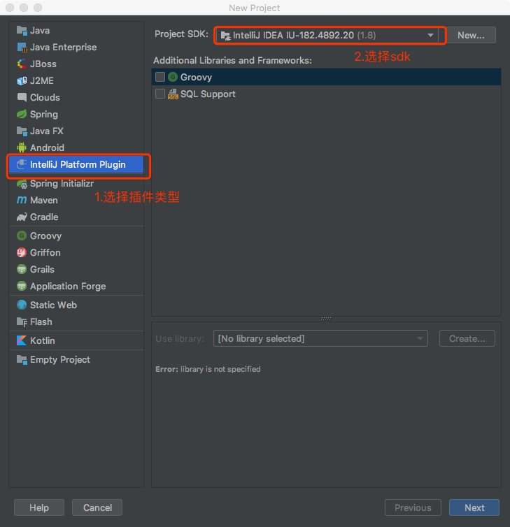
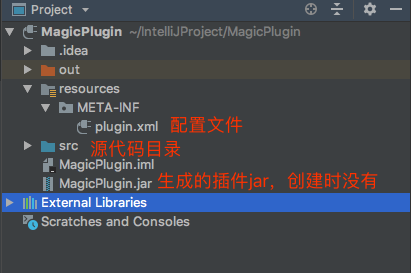
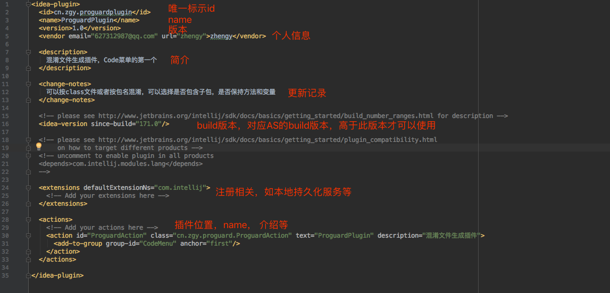
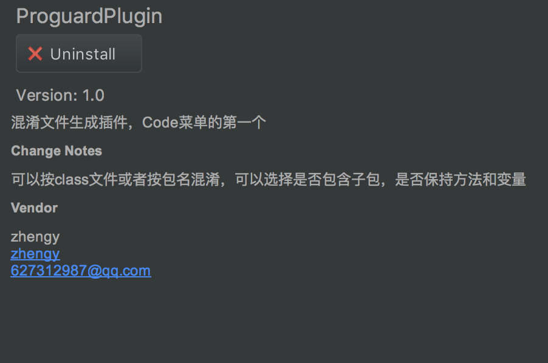

# Android Studio插件开发

## 开发工具

IntelliJ IDEA

## 基础

### 1. 创建项目



### 2. 项目结构



### 3. 配置文件plugin.xml



对应的as中显示的内容



至此，插件工程创建已完成，但要让插件运行起来，需要创建菜单点击的相应，如下

```
public class ProguardAction extends AnAction{
	@Override
    public void actionPerformed(AnActionEvent e) {
        // TODO: insert action logic here
      
    }
}
```

常见继承自AnAction的class，并实现actionPerformed函数，此函数就是菜单点击的相应。此action需要对应plugin.xml中action的注册，可以手动对照，也可以直接右键新建Action类，配置相关参数。

## 进阶

### 1. 定义Action
定义Action只需简单地定义一个继承AnAction的子类即可，子类中，最重要的就是actionPerformed函数和update函数。

#### 1.1 重写actionPerformed函数

每次在菜单项中点击我们自定义的Action时，对应会执行AnAction的actionPerformed函数。对应actionPerformed函数的理解，只需记住，当回调actionPerformed函数函数时，就意味着当前Action被点击了一次。重写actionPerformed函数非常简单，这里简单弹出一个Hello World。

```
public class MyAction extends AnAction {
    @Override
    public void actionPerformed(AnActionEvent event) {
        Project project = event.getData(PlatformDataKeys.PROJECT);
        Messages.showMessageDialog(project, "Hello World!", "Information", Messages.getInformationIcon());
    }
}

```

#### 1.2 重写update函数

> update函数在Action状态发生更新时被回调，当Action状态刷新时，update函数被IDEA回调，并且传递AnActionEvent对象，AnAction对象中封装了当前Action对应的环境。

如何理解上面这段话呢？我们知道，我们定义的每个Action都在菜单中对应一个子选项（为了方便描述，本文称之为Action菜单项），当Action菜单项被点击或者是Action的父菜单（包含Action菜单项的菜单）被点击使得Action菜单项被显示出来时，就会回调update函数。在update被回调时，传入AnActionEvent对象，通过AnActionEvent对象我们可以判断当前编辑框是否已经打开等实时IDEA环境状况。

> worn :先执行update函数，再执行actionPerformed函数。换言之，update发生在actionPerformed之前。

比如，我们想要实现：当编辑框被打开时显示自定义的Action菜单项，否则，将Action菜单项设置为灰色。

```
@Override
public void update(AnActionEvent e) {
    Editor editor = e.getData(PlatformDataKeys.EDITOR);

    if (editor != null)
        e.getPresentation().setEnabled(true);
    else
        e.getPresentation().setEnabled(false);

}
```
代码中，如果editor!=null即编辑框已打开，将Action菜单项设置为可用状态（即正常颜色，黑色），否则设置为不可用状态（即灰色）。

#### 1.3 AnActionEvent
AnActionEvent对象是我们与IntelliJ IDEA交互的桥梁，我们可以通过AnActionEvent对象获取当前IntelliJ IDEA的各个模块对象，如编辑框窗口对象、项目窗口对象等，获取到这些对象我们就可以做一些定制的效果。

##### 1.3.1 getData()
通过AnActionEvent对象的getData函数可以得到IDEA界面各个窗口对象以及各个窗口为实现某些特定功能的对象。getData函数需要传入DataKey<T>对象，用于指明想要获取的IDEA中的哪个对象。在CommonDataKeys已经定义好各个IDEA对象对应的DataKey<T>对象。

CommonDataKeys.java定义的DataKey<T>对象如下：

```java
    public static final DataKey<Project> PROJECT = DataKey.create("project");
    public static final DataKey<Editor> EDITOR = DataKey.create("editor");
    public static final DataKey<Editor> HOST_EDITOR = DataKey.create("host.editor");
    public static final DataKey<Caret> CARET = DataKey.create("caret");
    public static final DataKey<Editor> EDITOR_EVEN_IF_INACTIVE = DataKey.create("editor.even.if.inactive");
    public static final DataKey<Navigatable> NAVIGATABLE = DataKey.create("Navigatable");
    public static final DataKey<Navigatable[]> NAVIGATABLE_ARRAY = DataKey.create("NavigatableArray");
    public static final DataKey<VirtualFile> VIRTUAL_FILE = DataKey.create("virtualFile");
    public static final DataKey<VirtualFile[]> VIRTUAL_FILE_ARRAY = DataKey.create("virtualFileArray");
    public static final DataKey<PsiElement> PSI_ELEMENT = DataKey.create("psi.Element");
    public static final DataKey<PsiFile> PSI_FILE = DataKey.create("psi.File");
    public static final DataKey<Boolean> EDITOR_VIRTUAL_SPACE = DataKey.create("editor.virtual.space");

```

不仅仅CommonDataKeys中定义了DataKey<T>对象，为了添加更多的DataKey<T>对象并且兼容等，又提供了PlatformDataKeys类，PlatformDataKeys类是CommonDataKeys子类，也就是说，只要是CommonDataKeys有的，PlatformDataKeys类都有。

PlatformDataKeys.java定义的DataKey<T>对象如下：

```java
    public static final DataKey<FileEditor> FILE_EDITOR = DataKey.create("fileEditor");
    public static final DataKey<String> FILE_TEXT = DataKey.create("fileText");
    public static final DataKey<Boolean> IS_MODAL_CONTEXT = DataKey.create("isModalContext");
    public static final DataKey<DiffViewer> DIFF_VIEWER = DataKey.create("diffViewer");
    public static final DataKey<DiffViewer> COMPOSITE_DIFF_VIEWER = DataKey.create("compositeDiffViewer");
    public static final DataKey<String> HELP_ID = DataKey.create("helpId");
    public static final DataKey<Project> PROJECT_CONTEXT = DataKey.create("context.Project");
    public static final DataKey<Component> CONTEXT_COMPONENT = DataKey.create("contextComponent");
    public static final DataKey<CopyProvider> COPY_PROVIDER = DataKey.create("copyProvider");
    public static final DataKey<CutProvider> CUT_PROVIDER = DataKey.create("cutProvider");
    public static final DataKey<PasteProvider> PASTE_PROVIDER = DataKey.create("pasteProvider");
    public static final DataKey<DeleteProvider> DELETE_ELEMENT_PROVIDER = DataKey.create("deleteElementProvider");
    public static final DataKey<Object> SELECTED_ITEM = DataKey.create("selectedItem");
    public static final DataKey<Object[]> SELECTED_ITEMS = DataKey.create("selectedItems");
    public static final DataKey<Rectangle> DOMINANT_HINT_AREA_RECTANGLE = DataKey.create("dominant.hint.rectangle");
    public static final DataKey<ContentManager> CONTENT_MANAGER = DataKey.create("contentManager");
    public static final DataKey<ToolWindow> TOOL_WINDOW = DataKey.create("TOOL_WINDOW");
    public static final DataKey<TreeExpander> TREE_EXPANDER = DataKey.create("treeExpander");
    public static final DataKey<ExporterToTextFile> EXPORTER_TO_TEXT_FILE = DataKey.create("exporterToTextFile");
    public static final DataKey<VirtualFile> PROJECT_FILE_DIRECTORY = DataKey.create("context.ProjectFileDirectory");
    public static final DataKey<Disposable> UI_DISPOSABLE = DataKey.create("ui.disposable");
    public static final DataKey<ContentManager> NONEMPTY_CONTENT_MANAGER = DataKey.create("nonemptyContentManager");
    public static final DataKey<ModalityState> MODALITY_STATE = DataKey.create("ModalityState");
    public static final DataKey<Boolean> SOURCE_NAVIGATION_LOCKED = DataKey.create("sourceNavigationLocked");
    public static final DataKey<String> PREDEFINED_TEXT = DataKey.create("predefined.text.value");
    public static final DataKey<String> SEARCH_INPUT_TEXT = DataKey.create("search.input.text.value");
    public static final DataKey<Object> SPEED_SEARCH_COMPONENT = DataKey.create("speed.search.component.value");
    public static final DataKey<Point> CONTEXT_MENU_POINT = DataKey.create("contextMenuPoint");
```

##### 1.3.2. Presentation对象
一个Presentation对象表示一个Action在菜单中的外观，通过Presentation可以获取Action菜单项的各种属性，如显示的文本、描述、图标（Icon）等。并且可以设置当前Action菜单项的状态、是否可见、显示的文本等等。通过AnActionEvent对象的getPresentation()函数可以取得Presentation对象。可以通过e.getPresentation().setVisible(false);将Action菜单项设置为不可见，这样Action菜单项就不会出现在菜单中。

**插件开发的基础部分基本讲完了，其他一些诸如页面绘制，文件操作等，就是java等基本知识了，在此不做赘述，下面两款是两个插件模版，有兴趣的可以下载看一下**

[ProguardPlugin自动生成混淆文件](https://github.com/miaoyanrssq/ProguardPlugin)

[打字魔法效果插件](https://github.com/miaoyanrssq/ProguardPlugin)

