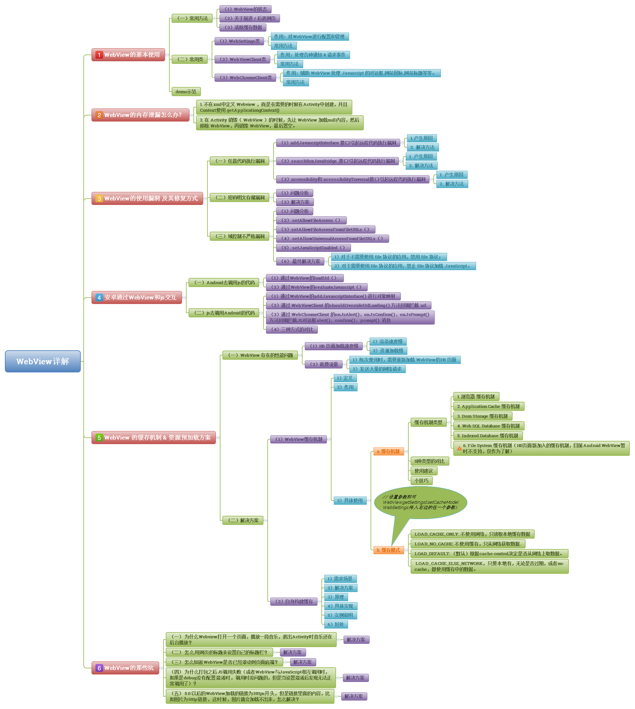

#WebView深度学习
> 前言：随着市场需求的不断变化，原生安卓已经无法满足客户的需要了，现在很多app都在使用Android和h5的交互实现某些功能，比如商品详情页，文章详情页面，商品点评页面，还有某些复杂的展示页面等等，设置登陆页面都有可能是和js交互做到的。通过交互可以很快速的达到效果，原生的安卓去做的话就会很麻烦。今天我就简单讲一下使用WebView做到js代码和安卓的交互，通过一个小demo教你学会js和Android的交互。

大纲：  

  

> 目录：  
> 
> 一、WebView的基本使用  
> 二、android通过WebView和js交互  
> 三、WebView的那些坑 
> 四、WebView的一些优化 
> 五、WebView的内存泄漏  
> 六、WebView的使用漏洞及修复方式  
> 七、WebView的缓存机制&资源预加载方案

##一、WebView的基本使用
>WebView是一个基于webkit引擎、展现web页面的控件。Webview在低版本和高版本采用了不同的webkit版本内核，4.4后直接使用了Chrome。
　　WebView控件功能强大，除了具有一般View的属性和设置外，还可以对url请求、页面加载(直接使用html文件（网络上或本地assets中）作布局)、渲染Wb页面、页面交互(和js交互)进行强大的处理。


###(一)常用方法
> * （1）WebView的状态  

```
//激活WebView为活跃状态，能正常执行网页的响应
webView.onResume() ；

//当页面被失去焦点被切换到后台不可见状态，需要执行onPause
//通过onPause动作通知内核暂停所有的动作，比如DOM的解析、plugin的执行、JavaScript执行。
webView.onPause()；

//当应用程序(存在webview)被切换到后台时，这个方法不仅仅针对当前的webview而是全局的全应用程序的webview
//它会暂停所有webview的layout，parsing，javascripttimer。降低CPU功耗。
webView.pauseTimers()

//恢复pauseTimers状态
webView.resumeTimers()；

//销毁Webview
//在关闭了Activity时，如果Webview的音乐或视频，还在播放。就必须销毁Webview
//但是注意：webview调用destory时,webview仍绑定在Activity上
//这是由于自定义webview构建时传入了该Activity的context对象
//因此需要先从父容器中移除webview,然后再销毁webview:
rootLayout.removeView(webView); 
webView.destroy();

```
> * (2) 关于前进/后退网页  

```
//是否可以后退
Webview.canGoBack() 
//后退网页
Webview.goBack()

//是否可以前进                     
Webview.canGoForward()
//前进网页
Webview.goForward()

//以当前的index为起始点前进或者后退到历史记录中指定的steps
//如果steps为负数则为后退，正数则为前进
Webview.goBackOrForward(intsteps)

```
常见用法：Back➖控制网页后退

```
问题：在不做任何处理前提下 ，浏览网页时点击系统的“Back”键,整个 Browser 会调用 finish()而结束自身
目标：点击返回后，是网页回退而不是推出浏览器

解决方案：在当前Activity中处理并消费掉该 Back 事件
public boolean onKeyDown(int keyCode, KeyEvent event) {
    if ((keyCode == KEYCODE_BACK) && mWebView.canGoBack()) { 
    mWebView.goBack();
    return true;
    }
    return super.onKeyDown(keyCode, event);
}
```
> * (3) 清楚缓存数据  

```
//清除网页访问留下的缓存
//由于内核缓存是全局的因此这个方法不仅仅针对webview而是针对整个应用程序.
Webview.clearCache(true);

//清除当前webview访问的历史记录
//只会webview访问历史记录里的所有记录除了当前访问记录
Webview.clearHistory()；

//这个api仅仅清除自动完成填充的表单数据，并不会清除WebView存储到本地的数据
Webview.clearFormData()；
```

### (二)常用类
> * (1) WebSetting类（对WebView进行配置和管理）

```
//生成一个WebView组件(两种方式)
//方式1：直接在在Activity中生成
WebView webView = new WebView(this)
//方法2：在Activity的layout文件里添加webview控件：
WebView webview = (WebView) findViewById(R.id.webView1);

//声明WebSettings子类
WebSettings webSettings = webView.getSettings();

//如果访问的页面中要与Javascript交互，则webview必须设置支持Javascript
webSettings.setJavaScriptEnabled(true);  

//支持插件
webSettings.setPluginsEnabled(true); 

//设置自适应屏幕，两者合用（下面这两个方法合用）
webSettings.setUseWideViewPort(true); //将图片调整到适合webview的大小 
webSettings.setLoadWithOverviewMode(true); // 缩放至屏幕的大小

//缩放操作
webSettings.setSupportZoom(true); //支持缩放，默认为true。是下面那个的前提。
webSettings.setBuiltInZoomControls(true); //设置内置的缩放控件。若为false，则该WebView不可缩放
webSettings.setDisplayZoomControls(false); //隐藏原生的缩放控件

//其他细节操作
webSettings.setCacheMode(WebSettings.LOAD_CACHE_ELSE_NETWORK); //关闭webview中缓存 
webSettings.setAllowFileAccess(true); //设置可以访问文件 
webSettings.setJavaScriptCanOpenWindowsAutomatically(true); //支持通过JS打开新窗口 
webSettings.setLoadsImagesAutomatically(true); //支持自动加载图片
webSettings.setDefaultTextEncodingName("utf-8");//设置编码格式

```

设置WebView缓存（当加载 html 页面时，WebView会在/data/data/包名目录下生成 database 与 cache 两个文件夹，请求的 URL记录保存在 WebViewCache.db，而 URL的内容是保存在 WebViewCache 文件夹下）

```
//优先使用缓存: 
WebView.getSettings().setCacheMode(WebSettings.LOAD_CACHE_ELSE_NETWORK); 
    //缓存模式如下：
    //LOAD_CACHE_ONLY: 不使用网络，只读取本地缓存数据
    //LOAD_DEFAULT: （默认）根据cache-control决定是否从网络上取数据。
    //LOAD_NO_CACHE: 不使用缓存，只从网络获取数据.
    //LOAD_CACHE_ELSE_NETWORK，只要本地有，无论是否过期，或者no-cache，都使用缓存中的数据。

//不使用缓存: 
WebView.getSettings().setCacheMode(WebSettings.LOAD_NO_CACHE);

```
结合使用（离线加载）（注意：每个 Application 只调用一次 WebSettings.setAppCachePath()，WebSettings.setAppCacheMaxSize()）

```
if (NetStatusUtil.isConnected(getApplicationContext())) {//判断网络是否连接
    webSettings.setCacheMode(WebSettings.LOAD_DEFAULT);//根据cache-control决定是否从网络上取数据。
} else {
    webSettings.setCacheMode(WebSettings.LOAD_CACHE_ELSE_NETWORK);//没网，则从本地获取，即离线加载
}

webSettings.setDomStorageEnabled(true); // 开启 DOM storage API 功能
webSettings.setDatabaseEnabled(true);   //开启 database storage API 功能
webSettings.setAppCacheEnabled(true);//开启 Application Caches 功能

String cacheDirPath = getFilesDir().getAbsolutePath() + APP_CACAHE_DIRNAME;
webSettings.setAppCachePath(cacheDirPath); //设置  Application Caches 缓存目录

```  

> * (2) WebViewClient类（处理各种通知&请求事件）

```
//步骤1. 定义Webview组件
Webview webview = (WebView) findViewById(R.id.webView1);

//步骤2. 选择加载方式
//方式a. 加载一个网页：
webView.loadUrl("http://www.google.com/");
//方式b：加载apk包中的html页面
webView.loadUrl("file:///android_asset/test.html");
//方式c：加载手机本地的html页面
webView.loadUrl("content://com.android.htmlfileprovider/sdcard/test.html");

//步骤3. 复写shouldOverrideUrlLoading()方法，
webView.setWebViewClient(new WebViewClient(){
  @Override
  public boolean shouldOverrideUrlLoading(WebView view, String url) {
    //使得打开网页时不调用系统浏览器， 而是在本WebView中显示
    view.loadUrl(url);
    return true;
  }

  @Override
  public void  onPageStarted(WebView view, String url, Bitmap favicon) {
    //设定加载开始的操作
  }

  @Override
  public void onPageFinished(WebView view, String url) {
    //设定加载结束的操作
  }

  @Override
  public boolean onLoadResource(WebView view, String url) {
    //设定加载资源的操作
  }

  @Override
  public void onReceivedError(WebView view, int errorCode, String description, String failingUrl){
    switch(errorCode){
    //该方法传回了错误码，根据错误类型可以进行不同的错误分类处理 
      case HttpStatus.SC_NOT_FOUND:
        view.loadUrl("file:///android_assets/error_handle.html");
        break;
    }
  }

  @Override    
  public void onReceivedSslError(WebView view, SslErrorHandler handler, SslError error) {//处理https请  
    handler.proceed();    //表示等待证书响应
    // handler.cancel();      //表示挂起连接，为默认方式
    // handler.handleMessage(null);    //可做其他处理
  }    
});

```
> * (3) WebChromeClient类（辅助WebView处理Javascript的对话框，网站图标，网站标题等）

```
webview.setWebChromeClient(new WebChromeClient(){
      @Override
      public void onProgressChanged(WebView view, int newProgress) {
          if (newProgress < 100) {
          String progress = newProgress + "%";
          progress.setText(progress);
          }else{
          // to do something...
          }
      }

      @Override
      public void onReceivedTitle(WebView view, String title) {
         titleview.setText(title)；
      }      
  });

``` 

## 二、Android通过WebView和js交互

Android与js通过WebView互相调用方法， 二者沟通呢的桥梁是WebView，实际上是：  
> * Android去调用js的代码
> * js去调用Android的代码  

对于**Android调用js代码** 的方法有2种：  
> * 1.通过WebView的loadUrl（）
> * 2.通过WebView的evaluateJavascript（）

对于**js调用Android代码**的方法有三种：  
> * 1.通过WebView的addJavaScriptInterface（）进行对象映射
> * 2.通过WebViewClient的shouldOverrideUrlLoading方法回调拦截url
> * 3.通过WebChromeClient的onJsAlert（）、onJsConfirm（）、onJsPrompt（）方法回调连接js对话框的alert（）、confirm（）、prompt（）消息

### （一）Android调用js代码
> * (1) 通过WebView的loadUrl（）

实例说明：为了方便展示，本文是采用Andorid调用本地JS代码说明。实际开发中，Android更多的是调用远程JS代码，即将加载的JS代码路径改成url即可。

* 步骤1：将需要调用的JS代码以.html格式放到 src/main/assets 文件夹里
需要加载JS代码：javascript.html

```
<!DOCTYPE html>
<html>
   <head>
      <meta charset="utf-8">
      <title>Android调用 JS 代码demo</title>
// JS代码
     <script>
       // Android需要调用的方法
       function callJS(){
          alert("Android调用了JS的callJS方法");
       }
    </script>
   </head>
</html>
```
* 步骤2: 在Android里通过WebView设置调用js代码  

Android代码：MainActivity.java

```
public class MainActivity extends AppCompatActivity {

    WebView mWebView;
    Button button;

    @Override
    protected void onCreate(Bundle savedInstanceState) {
        super.onCreate(savedInstanceState);
        setContentView(R.layout.activity_main);
       
       mWebView =(WebView) findViewById(R.id.webview);
        WebSettings webSettings = mWebView.getSettings();

        // 设置与Js交互的权限
        webSettings.setJavaScriptEnabled(true);
        // 设置允许JS弹窗
        webSettings.setJavaScriptCanOpenWindowsAutomatically(true);

        // 先载入JS代码
        // 格式规定为:file:///android_asset/文件名.html
        mWebView.loadUrl("file:///android_asset/javascript.html");
        button = (Button) findViewById(R.id.button);

        button.setOnClickListener(new View.OnClickListener() {
            @Override
            public void onClick(View v) {
                // 必须另开线程进行JS方法调用(否则无法调用)
                mWebView.post(new Runnable() {
                    @Override
                    public void run() {

                        // 注意调用的JS方法名要对应上
                        // 调用javascript的callJS()方法
                        mWebView.loadUrl("javascript:callJS()");
                    }
                });

            }
        });

        // 由于设置了弹窗检验调用结果,所以需要支持js对话框
        // webview只是载体，内容的渲染需要使用webviewChromClient类去实现
        // 通过设置WebChromeClient对象处理JavaScript的对话框
        //设置响应js 的Alert()函数
        mWebView.setWebChromeClient(new WebChromeClient() {
            @Override
            public boolean onJsAlert(WebView view, String url, String message, final JsResult result) {
                AlertDialog.Builder b = new AlertDialog.Builder(MainActivity.this);
                b.setTitle("Alert");
                b.setMessage(message);
                b.setPositiveButton(android.R.string.ok, new DialogInterface.OnClickListener() {
                    @Override
                    public void onClick(DialogInterface dialog, int which) {
                        result.confirm();
                    }
                });
                b.setCancelable(false);
                b.create().show();
                return true;
            }
        });
    }
}
```
> * (2) 通过WebView的evaluateJavascript（）

说明：该方法比第一种方法效率更高，因为该方法的执行不会使页面刷新，而第一种方法（loadUrl ）的执行则会。该方法在Android 4.4 后才可使用。

// 只需要将第一种方法的loadUrl()换成下面该方法即可

```
mWebView.evaluateJavascript（"javascript:callJS()", 
    new ValueCallback<String>() {
        @Override
        public void onReceiveValue(String value) {
            //此处为 js 返回的结果
        }
    });
}

```

> * (3) 两种方法的对比  

![] (image/compare1.png)

> * (4)建议使用  

两种方法混合使用，几4.4一下使用方法1， 4.4以上使用方法2

```
// Android版本变量
final int version = Build.VERSION.SDK_INT;
// 因为该方法在 Android 4.4 版本才可使用，所以使用时需进行版本判断
if (version < 18) {
    mWebView.loadUrl("javascript:callJS()");
} else {
    mWebView.evaluateJavascript（"javascript:callJS()", new ValueCallback<String>() {
        @Override
        public void onReceiveValue(String value) {
            //此处为 js 返回的结果
        }
    });
}
```

### (二) js通过WebView调用Android代码

[引用连接：具体实例请点击] (https://www.jianshu.com/p/b9164500d3fb)

* 三种方式的对比&使用场景  

![] (image/compare2.png)

## 三、WebView的那些坑
> * (1) 为什么WebView打开一个页面，播放一段音乐，推出Activity时音乐还在后台播放？

◆◆ 解决方案 1：

```
//销毁Webview
@Override
protected void onDestroy() {
    if (mWebview != null) {
        mWebview.loadDataWithBaseURL(null, "", "text/html", "utf-8", null);
        mWebview.clearHistory();
        ((ViewGroup) mWebview.getParent()).removeView(mWebview);
        mWebview.destroy();
        mWebview = null;
    }
    super.onDestroy();
}
```
◆◆ 解决方案 2：

```
@Override
protected void onPause() {
   h5_webview.onPause();
   h5_webview.pauseTimers();
   super.onPause();
}
@Override
protected void onResume() {
   h5_webview.onResume();
   h5_webview.resumeTimers();
   super.onResume();
}
```
Webview的onPause()方法官网是这么解释的：

```
Does a best-effort attempt to pause any processing that can be paused safely, such as animations
and geolocation. Note that this call does not pause JavaScript. To pause JavaScript globally, use 
pauseTimers(). To resume WebView, call onResume().  
【翻译：】通知内核尝试停止所有处理，如动画和地理位置，但是不能停止Js，如果想全局停止Js，
可以调用pauseTimers()全局停止Js，调用onResume()恢复。
```
> * (2) 怎么用网页的标题来设置自己的标题栏

```
WebChromeClient mWebChromeClient = new WebChromeClient() {    
    @Override    
    public void onReceivedTitle(WebView view, String title) {    
        super.onReceivedTitle(view, title);    
        txtTitle.setText(title);    
    }    
};  
mWedView.setWebChromeClient(mWebChromeClient());

作者：AWeiLoveAndroid
链接：https://www.jianshu.com/p/2b2e5d417e10
來源：简书
著作权归作者所有。商业转载请联系作者获得授权，非商业转载请注明出处。
```
★★ 注意事项：

```
●   1.可能当前页面没有标题，获取到的是null，那么你可以在跳转到该Activity的时候自己带一个标题，或者有一个默认标题。
●   2.在一些机型上面，Webview.goBack()后，这个方法不一定会调用，所以标题还是之前页面的标题。那么
你就需要用一个ArrayList来保持加载过的url,一个HashMap保存url及对应的title.然后就是用WebView.canGoBack()来做判断处理了。
```
> * (3) 为什么打包之后JS调用失败（或者WebView与JavaScript相互调用时，如果是debug没有配置混淆时，调用时没问题的，但是当设置混淆后发现无法正常调用了）？

◆◆ 解决方案：在proguard-rules.pro中添加混淆。  

```
-keepattributes *Annotation*  
-keepattributes *JavascriptInterface*
-keep public class org.mq.study.webview.DemoJavaScriptInterface{
   public <methods>;
}
#假如是内部类，混淆如下：
-keepattributes *JavascriptInterface*
-keep public class org.mq.study.webview.webview.DemoJavaScriptInterface$InnerClass{
    public <methods>;
}

其中org.mq.study.webview.DemoJavaScriptInterface 是不需要混淆的类名
```
> * (4) 5.0 以后的WebView加载的链接为Https开头，但是链接里面的内容，比如图片为Http链接，这时候，图片就会加载不出来，怎么解决？

★★ 原因分析：原因是Android 5.0上Webview默认不允许加载Http与Https混合内容：

◆◆ 解决方案：

```
if (Build.VERSION.SDK_INT >= Build.VERSION_CODES.LOLLIPOP) { 
    //两者都可以
    webSetting.setMixedContentMode(webSetting.getMixedContentMode());
    //mWebView.getSettings().setMixedContentMode(WebSettings.MIXED_CONTENT_ALWAYS_ALLOW);
}

★★ 参数说明：
●   MIXED_CONTENT_ALWAYS_ALLOW 允许从任何来源加载内容，即使起源是不安全的；
●   MIXED_CONTENT_NEVER_ALLOW 不允许Https加载Http的内容，即不允许从安全的起源去加载一个不安全的
    资源；
●   MIXED_CONTENT_COMPLTIBILITY_MODE 当涉及到混合式内容时，WebView会尝试去兼容最新Web浏览器的
    风格；
```
另外：在认证证书不被Android所接受的情况下，我们可以通过设置重写WebViewClient的onReceivedSslError方法在其中设置接受所有网站的证书来解决，具体代码如下：

```
webView.setWebViewClient(new WebViewClient() {
        @Override
        public void onReceivedSslError(WebView view,
                SslErrorHandler handler, SslError error) {
            //super.onReceivedSslError(view, handler, error);注意一定要去除这行代码，否则设置无效。
            // handler.cancel();// Android默认的处理方式
            handler.proceed();// 接受所有网站的证书
            // handleMessage(Message msg);// 进行其他处理
        }
});
```
> * (5)WebView调用手机系统相册来上传图片，开发过程中发现在很多机器上无法正常唤起系统相册来选择图片。怎么解决？

★★ 原因分析：因为Google攻城狮们对setWebChromeClient的回调方法openFileChooser做了多次修改，5.0以下openFileChooser有几种重载方法，在5.0以上将回调方法该为了onShowFileChooser。

◆◆ 解决方案：为了兼容各个版本，我们需要对openFileChooser()进行重载，同时针对5.0及以上重写onShowFileChooser()方法：

上一段示例代码，给大家看看：

```
public class MainActivity extends AppCompatActivity {

private ValueCallback<Uri> uploadMessage;
private ValueCallback<Uri[]> uploadMessageAboveL;
private final static int FILE_CHOOSER_RESULT_CODE = 10000;

@Override
protected void onCreate(Bundle savedInstanceState) {
    super.onCreate(savedInstanceState);
    setContentView(R.layout.activity_main);

    WebView webview = (WebView) findViewById(R.id.web_view);
    assert webview != null;
    WebSettings settings = webview.getSettings();
    settings.setUseWideViewPort(true);
    settings.setLoadWithOverviewMode(true);
    settings.setJavaScriptEnabled(true);
    webview.setWebChromeClient(new WebChromeClient() {

        //  android 3.0以下：用的这个方法
        public void openFileChooser(ValueCallback<Uri> valueCallback) {
            uploadMessage = valueCallback;
            openImageChooserActivity();
        }

        // android 3.0以上，android4.0以下：用的这个方法
        public void openFileChooser(ValueCallback valueCallback, String acceptType) {
            uploadMessage = valueCallback;
            openImageChooserActivity();
        }

        //android 4.0 - android 4.3  安卓4.4.4也用的这个方法
        public void openFileChooser(ValueCallback<Uri> valueCallback, String acceptType, 
                        String capture) {
            uploadMessage = valueCallback;
            openImageChooserActivity();
        }

        //android4.4 无方法。。。

        // Android 5.0及以上用的这个方法
        @Override
        public boolean onShowFileChooser(WebView webView, ValueCallback<Uri[]> 
                 filePathCallback, WebChromeClient.FileChooserParams fileChooserParams) {
            uploadMessageAboveL = filePathCallback;
            openImageChooserActivity();
            return true;
        }
    });
    String targetUrl = "file:///android_asset/up.html";
    webview.loadUrl(targetUrl);
}

private void openImageChooserActivity() {
    Intent i = new Intent(Intent.ACTION_GET_CONTENT);
    i.addCategory(Intent.CATEGORY_OPENABLE);
    i.setType("image/*");
    startActivityForResult(Intent.createChooser(i, "Image Chooser"),
                  FILE_CHOOSER_RESULT_CODE);
}

@Override
protected void onActivityResult(int requestCode, int resultCode, Intent data) {
    super.onActivityResult(requestCode, resultCode, data);
    if (requestCode == FILE_CHOOSER_RESULT_CODE) {
        if (null == uploadMessage && null == uploadMessageAboveL) return;
        Uri result = data == null || resultCode != RESULT_OK ? null : data.getData();
        if (uploadMessageAboveL != null) {
            onActivityResultAboveL(requestCode, resultCode, data);
        } else if (uploadMessage != null) {
            uploadMessage.onReceiveValue(result);
            uploadMessage = null;
        }
    }
}

@TargetApi(Build.VERSION_CODES.LOLLIPOP)
private void onActivityResultAboveL(int requestCode, int resultCode, Intent intent) {
    if (requestCode != FILE_CHOOSER_RESULT_CODE || uploadMessageAboveL == null)
        return;
    Uri[] results = null;
    if (resultCode == Activity.RESULT_OK) {
        if (intent != null) {
            String dataString = intent.getDataString();
            ClipData clipData = intent.getClipData();
            if (clipData != null) {
                results = new Uri[clipData.getItemCount()];
                for (int i = 0; i < clipData.getItemCount(); i++) {
                    ClipData.Item item = clipData.getItemAt(i);
                    results[i] = item.getUri();
                }
            }
            if (dataString != null)
                results = new Uri[]{Uri.parse(dataString)};
        }
    }
    uploadMessageAboveL.onReceiveValue(results);
    uploadMessageAboveL = null;
}
```

重点坑：针对Android4.4，系统把openFileChooser方法去掉了，怎么解决？

详情请见 [博客:http://blog.csdn.net/xiexie758/article/details/52446937] (http://blog.csdn.net/xiexie758/article/details/52446937) 

> * (6) WebView调用手机系统相册来上传图片，处理好第六点说的方法，我们打好release包测试的时候却又发现还是没法选择图片了。怎么解决？

★★ 原因分析：无奈去翻WebChromeClient的源码，发现openFileChooser()是系统API，我们的release包是开启了混淆的，所以在打包的时候混淆了openFileChooser()，这就导致无法回调openFileChooser()了。

◆◆ 解决方案也很简单，直接不混淆openFileChooser()就好了。

```
-keepclassmembers class * extends android.webkit.WebChromeClient{
   public void openFileChooser(...);
}
```
> * (7) 怎么在WebView中长按保存图片

1.给WebView添加监听

```
mWebview.setOnLongClickListener(new View.OnLongClickListener() {
    @Override
    public boolean onLongClick(View v) {
    }
});
```
2.获取点击的图片的地址  
先获取类型，根据相应的类型来处理对应的数据

```
//首先判断点击的类型
WebView.HitTestResult result = ((WebView) v).getHitTestResult();
int type = result.getType();

//获取具体信息，图片这里就是图片地址
String imgurl = result.getExtra();
```
type有这几种类型：

* WebView.HitTestResult.UNKNOWN_TYPE 未知类型
* WebView.HitTestResult.PHONE_TYPE 电话类型
* WebView.HitTestResult.EMAIL_TYPE 电子邮件类型
* WebView.HitTestResult.GEO_TYPE 地图类型
* WebView.HitTestResult.SRC_ANCHOR_TYPE 超链接类型
* WebView.HitTestResult.SRC_IMAGE_ANCHOR_TYPE 带有链接的图片类型
* WebView.HitTestResult.IMAGE_TYPE 单纯的图片类型
* WebView.HitTestResult.EDIT_TEXT_TYPE 选中的文字类型

3.操作图片  
你可以弹出保存图拼啊，或者点击之后跳转到显示图片的页面。

```
mWebView.setOnLongClickListener(new View.OnLongClickListener() {
    @Override
    public boolean onLongClick(View v) {
        WebView.HitTestResult result = ((WebView)v).getHitTestResult();
        if (null == result)
            return false;
        int type = result.getType();
        if (type == WebView.HitTestResult.UNKNOWN_TYPE)
            return false;

        // 这里可以拦截很多类型，我们只处理图片类型就可以了
        switch (type) {
            case WebView.HitTestResult.PHONE_TYPE: // 处理拨号
                break;
            case WebView.HitTestResult.EMAIL_TYPE: // 处理Email
                break;
            case WebView.HitTestResult.GEO_TYPE: // 地图类型
                break;
            case WebView.HitTestResult.SRC_ANCHOR_TYPE: // 超链接
                break;
            case WebView.HitTestResult.SRC_IMAGE_ANCHOR_TYPE:
                break;
            case WebView.HitTestResult.IMAGE_TYPE: // 处理长按图片的菜单项
                // 获取图片的路径
                String saveImgUrl = result.getExtra();

                // 跳转到图片详情页，显示图片
                Intent i = new Intent(MainActivity.this, ImageActivity.class);
                i.putExtra("imgUrl", saveImgUrl);
                startActivity(i);
                break;
            default:
                break;
        }
    }
});
```
> * (8)WebView开启硬件加速导致的问题

WebView有很多问题，比如：不能打开pdf，播放视屏也只能打开硬件加速才能支持，在某些机型上会崩溃。
下面看一下硬件加速， 硬件加速 分为四个级别：
Application, Activity, window（目前，Android还不支持在Window级别关闭硬件加速）, View级别  

```
<application android:hardwareAccelerated="true"...>
```
```
<activity android:hardwareAccelerated="true"...>
```
```
getWindow().setFlags(
         WindowManager.LayoutParams.FLAG_HARDWARE_ACCELERATED,
         WindowManager.LayoutParams.FLAG_HARDWARE_ACCELERATED);
```
```
view.setLayerType(View.LAYER_TYPE_HARDWARE, null);

```
**WebView开启硬件加速导致屏幕花屏问题的解决：**

★★ 原因分析：
4.0以上的系统我们开启硬件加速后，WebView渲染页面更加快速，拖动也更加顺滑。但有个副作用就是，当WebView视图被整体遮住一块，然后突然恢复时（比如使用SlideMenu将WebView从侧边滑出来时），这个过渡期会出现白块同时界面闪烁。

◆◆ 解决方案：
在过渡期前将WebView的硬件加速临时关闭，过渡期后再开启，代码如下：

```
if (Build.VERSION.SDK_INT >= Build.VERSION_CODES.HONEYCOMB) {
        webview.setLayerType(View.LAYER_TYPE_SOFTWARE, null);
    }
```
**Android 4.0+ 版本中的EditText字符重叠问题：**

做的软件，在一些机器上，打字的时候，EditText中的内容会出现重叠，而大部分机器没有，所以感觉不是代码的问题，一直没有头绪。

出现原因：JellyBean的硬件加速bug，在此我们关掉硬件加速即可。
解决方案：在EditText中加入一句：

```
android:layerType="software"
```
**图片无法显示：**
做的程序里有的时候会需要加载大图，但是硬件加速中 OpenGL对于内存是有限制的。如果遇到了这个限制，LogCat只会报一个Warning: Bitmap too large to be uploaded into a texture (587x7696, max=2048x2048)

这时我们就需要把硬件加速关闭了。
但开始我是这样处理的，我关闭了整个应用的硬件加速：

```
<application  
    android:allowBackup="true"  
    android:icon="@drawable/ic_launcher"  
    android:hardwareAccelerated="false"  
    android:label="@string/app_name"  
    android:theme="@style/AppTheme" >

```

随后我就发现，虽然图片可以显示了，但是ListView和WebView等控件显得特别的卡，这说明硬件加速对于程序的性能提升是很明显的。所以我就改为对于Activity的关闭。

```
<activity  
    android:name="icyfox.webviewimagezoomertest.MainActivity"  
    android:label="@string/app_name"  
    android:hardwareAccelerated="false"
```

> * (9) ViewPager里非首屏WebView点击事件不相应

如果你的多个WebView是放在ViewPager里一个个加载出来的，那么就会遇到这样的问题。ViewPager首屏WebView的创建是在前台，点击时没有问题；而其他非首屏的WebView是在后台创建，滑动到它后点击页面会出现如下错误日志：

```
20955-20968/xx.xxx.xxx E/webcoreglue﹕ Should not happen: no rect-based-test nodes found
```
◆◆ 解决方案：  
这个问题的办法是继承WebView类，在子类覆盖onTouchEvent方法，填入如下代码：

```
@Override
public boolean onTouchEvent(MotionEvent ev) {
    if (ev.getAction() == MotionEvent.ACTION_DOWN) {
        onScrollChanged(getScrollX(), getScrollY(), getScrollX(), getScrollY());
    }
    return super.onTouchEvent(ev);
}
```

> * (10) WebView 白屏

◆◆ 解决方案： 

```
if (Build.VERSION.SDK_INT >= Build.VERSION_CODES.HONEYCOMB) {
    setLayerType(View.LAYER_TYPE_SOFTWARE, null);
}
```

> * 1.LAYER_TYPE_NONE：表明视图没有多余渲染层。
* 2.LAYER_TYPE_SOFTWARE：表明视图有一个软件渲染层。无论是否开启硬件加速，都会有一张
Bitmap（software layer），并在上面对 WebView 进行渲染。
好处：在进行动画，使用software可以只画一次ViewTree，很省。
不适合使用场景：View树经常更新时不要用。尤其是在硬件加速打开时，每次更新消耗的时间更多。因为渲染完这张Bitmap后还需要再把这张Bitmap渲染到hardware layer上面去。
* 3.LAYER_TYPE_HARDWARE：
表明视图有一个硬件渲染层。硬件加速关闭时，作用同software。硬件加速打开时会在FBO（Framebuffer Object）上做渲染，在进行动画时，View树也只需要画一次。

◆◆ LAYER_TYPE_SOFTWARE 和 LAYER_TYPE_HARDWARE的区别：

```
1.前者是渲染到Bitmap，后者是渲染到FB上。
2.hardware可能会有一些操作不支持（出现白屏）。
```
◆◆ LAYER_TYPE_SOFTWARE 和 LAYER_TYPE_HARDWARE的相同：

```
都是开了一个buffer，把View画到这个buffer上面去。
```

## 四、WebView的一点优化
> * (1)给WebView加一个加载进度条

```
private class MyWebCromeClient extends WebChromeClient {
    @Override
    public void onProgressChanged(WebView view, int newProgress) {
        if (newProgress == 100) {
            //加载完毕进度条消失
            progressView.setVisibility(View.GONE);
        } else {
            //更新进度
            progressView.setProgress(newProgress);
        }
        super.onProgressChanged(view, newProgress);
    }
}
```
> * (2) 加快HTML网页加载完成速度，等页面finish再加载图片

默认情况html代码下载到WebView后，webkit开始解析网页各个节点，发现有外部样式文件或者外部脚本文件时，会异步发起网络请求下载文件，但如果在这之前也有解析到image节点，那势必也会发起网络请求下载相应的图片。在网络情况较差的情况下，过多的网络请求就会造成带宽紧张，影响到css或js文件加载完成的时间，造成页面空白loading过久。解决的方法就是告诉WebView先不要自动加载图片，等页面finish后再发起图片加载。

◆◆ 解决办法：

在WebView初始化时设置如下代码：

```
public void int () {
    if(Build.VERSION.SDK_INT >= 19) {
        webView.getSettings().setLoadsImagesAutomatically(true);
    } else {
        webView.getSettings().setLoadsImagesAutomatically(false);
    }
}

```
同时在WebView的WebViewClient实例中的onPageFinished()方法添加如下代码：

```
@Override
public void onPageFinished(WebView view, String url) {
    if(!webView.getSettings().getLoadsImagesAutomatically()) {
        webView.getSettings().setLoadsImagesAutomatically(true);
    }
}
```
> * (3) 自定义WebView页面加载出错界面

当WebView加载页面出错时（一般为404 NOT FOUND），安卓WebView会默认显示一个卖萌的出错界面。但我们怎么能让用户发现原来我使用的是网页应用呢，我们期望的是用户在网页上得到是如原生般应用的体验，那就先要从干掉这个默认出错页面开始。当WebView加载出错时，我们会在WebViewClient实例中的onReceivedError()方法接收到错误，我们就在这里做些手脚：

```
@Override
public void onReceivedError (WebView view, int errorCode, String description, String failingUrl) {
    super.onReceivedError(view, errorCode, description, failingUrl);
    loadDataWithBaseURL(null, "", "text/html", "utf-8", null);
    mErrorFrame.setVisibility(View.VISIBLE);
}
```
  从上面可以看出，我们先使用loadDataWithBaseURL清除掉默认错误页内容，再让我们自定义的View得到显示（mErrorFrame为蒙在WebView之上的一个LinearLayout布局，默认为View.GONE）。

> * (4) 怎么知道WebView是否已经滚动到页面底端了？

* 方案1，使用原生WebView的api可以获取到：

```
    if (mWebView.getContentHeight() * mWebView.getScale()  == (mWebView.getHeight() + 
    mWebView.getScrollY())) {
        //说明已经到底了
    }
```
* 方案2，继承WebView，重写onScrollChanged方法：
  我们在做上拉加载下一页这样的功能时，也需要知道当前页面滚动条所处的状态，如果快到底部，则要发起网络请求数据更新网页。同样继承WebView类，在子类覆盖onScrollChanged方法。
  以下代码中mCurrContentHeight用于记录上次触发时的网页高度，用来防止在网页总高度未发生变化而目标区域发生连续滚动时会多次触发TODO，mThreshold是一个阈值，当页面底部距离滚动条底部的高度差<=这个值时会触发TODO里面的代码。
具体如下：

```
@Override
protected void onScrollChanged(int newX, int newY, int oldX, int oldY) {
    super.onScrollChanged(newX, newY, oldX, oldY);
    if (newY != oldY) {
        float contentHeight = getContentHeight() * getScale();
        // 当前内容高度下从未触发过, 浏览器存在滚动条且滑动到将抵底部位置
        if (mCurrContentHeight != contentHeight && newY > 0 && contentHeight <= newY + getHeight() + mThreshold) {
            // TODO Something...
            mCurrContentHeight = contentHeight;
        }
    }
}
```
★★ 相关API介绍：

```
●   getContentHeight() @return the height of the HTML content
●   getScale() @return the current scale
●   getHeight() @return The height of your view
●   getScrollY() @return The top edge of the displayed part of your view, in pixels.
```
> * (5) 怎么知道WebView是否存在滚动条

当我们做类似上拉加载下一页这样的功能的时候，页面初始的时候需要知道当前WebView是否存在纵向滚动条，如果有则不加载下一页，如果没有则加载下一页直到其出现纵向滚动条。
  首先继承WebView类，在子类添加下面的代码：

```
public boolean existVerticalScrollbar () {
    return computeVerticalScrollRange() > computeVerticalScrollExtent();
}
```
  computeVerticalScrollRange得到的是可滑动的最大高度，computeVerticalScrollExtent得到的是滚动把手自身的高，当不存在滚动条时，两者的值是相等的。当有滚动条时前者一定是大于后者的。
  
##五、 WebView的内存泄漏
> 1.不在xml中定义 Webview ，而是在需要的时候在Activity中创建，并且Context使用 getApplicationgContext()

```
LinearLayout.LayoutParams params = new LinearLayout.LayoutParams(ViewGroup.LayoutParams.MATCH_PARENT,ViewGroup.LayoutParams.MATCH_PARENT);
mWebView = new WebView(getApplicationContext());
mWebView.setLayoutParams(params);
mLayout.addView(mWebView);
```
> * 2. 在 Activity 销毁（ WebView ）的时候，先让 WebView 加载null内容，然后移除 WebView，再销毁 WebView，最后置空。

```
@Override
protected void onDestroy() {
    if (mWebView != null) {
        mWebView.loadDataWithBaseURL(null, "", "text/html", "utf-8", null);
        mWebView.clearHistory();

        ((ViewGroup) mWebView.getParent()).removeView(mWebView);
        mWebView.destroy();
        mWebView = null;
    }
    super.onDestroy();
}
```


