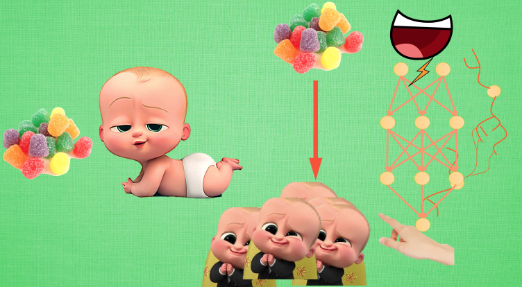
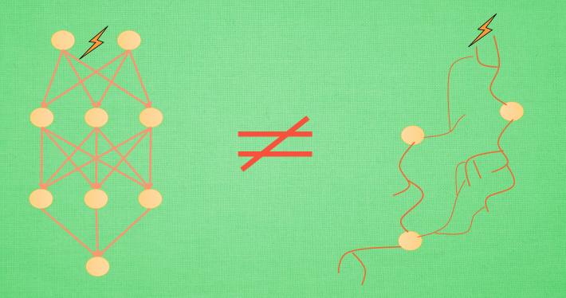
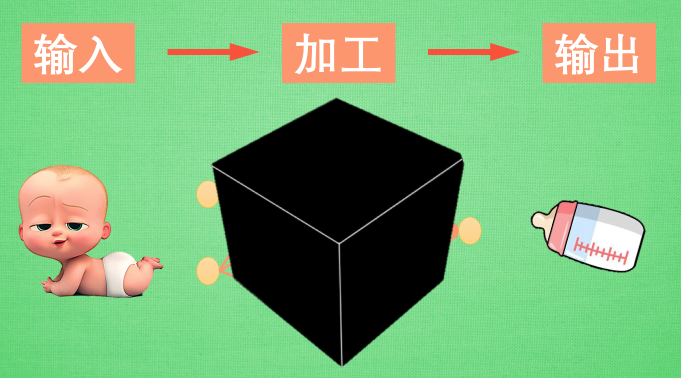
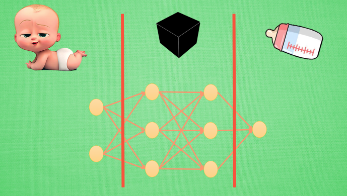
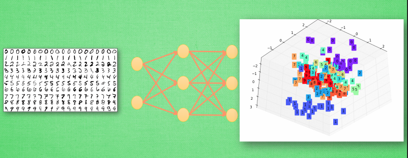
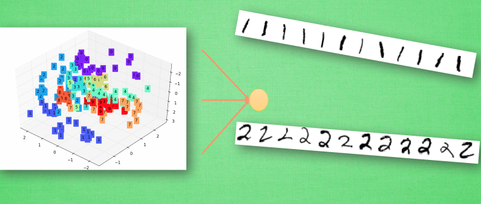
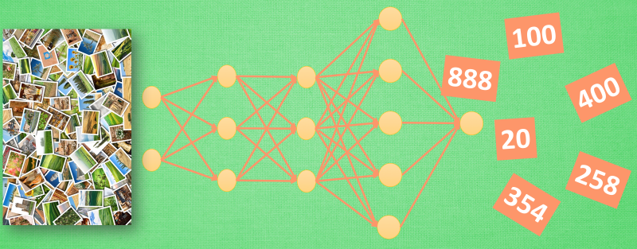

#机器学习Tensorflow（1）
> [参考连接](https://morvanzhou.github.io/tutorials/machine-learning/tensorflow/1-1-A-ANN-and-NN/)

##人工神经网络vs生物神经网络

###生物神经网络

9百亿神经细胞组成了我们复杂的神经网络系统, 这个数量甚至可以和宇宙中的星球数相比较. 如果仅仅靠单个的神经元, 是永远没有办法让我们像今天一样, 完成各种任务, 处理各种复杂的问题. 那我们是如何靠这些神经元来解决问题的呢? 首先需要知道的是我们的记忆是如何产生的. 想象我们还是婴儿,

包着尿布的我们什么都不知道, 神经元并没有形成系统和网络. 可能只是一些分散的细胞而已, 一端连着嘴巴的味觉感受器, 一端连着手部的肌肉. 小时候, 世界上有一种神奇的东西叫做 – 糖果, 当我们第一次品尝它的时候, 美妙的感觉, 让我们发现活着是多么有意义的事情. 这时候神经元开始产生联结 , 记忆形成, 但是形成的新联结怎么样变成记忆, 仍然是科学界的一个迷. 不过现在, 我们的手和嘴产生了某种特定的搭配. 每次发现有糖果的时候, 某种生物信号就会从我们的嘴,通过之前形成的神经联结, 传递到手上, 让手的动作变得有意义, 比如这样, 然后爸妈就会再给我们一颗糖果啦~ 哈哈, 吃糖的目的达成. 现在我们来看看人工神经网络要怎样达到这个目的.

###人工神经网络

首先, 替代掉生物神经网络的, 就是已经成体系的人工神经网络. 所有神经元之间的连接都是固定不可更换的, 这也就是说, 在人工神经网络里, 没有凭空产生新联结这回事. 人工神经网络典型的一种学习方式就是, 我已经知道吃到糖果时, 手会如何动, 但是我想让神经网络学着帮我做这件动动手的事情. 所以我预先准备好非常多吃糖的学习数据, 然后将这些数据一次次放入这套人工神经网络系统中, 糖的信号会通过这套系统传递到手. 然后通过对比这次信号传递后, 手的动作是不是”讨糖”动作, 来修改人工神经网络当中的神经元强度. 这种修改在专业术语中叫做”误差反向传递”, 也可以看作是再一次将传过来的信号传回去, 看看这个负责传递信号神经元对于”讨糖”的动作到底有没有贡献, 让它好好反思与改正, 争取下次做出更好的贡献. 这样看来, 人工神经网络和生物神经网络的确不是一回事.

###两者的区别

人工神经网络靠的是正向和反向传播来更新神经元, 从而形成一个好的神经系统, 本质上, 这是一个能让计算机处理和优化的数学模型. 而生物神经网络是通过刺激, 产生新的联结, 让信号能够通过新的联结传递而形成反馈. 虽然现在的计算机技术越来越高超, 不过我们身体里的神经系统经过了数千万年的进化, 还是独一无二的, 迄今为止, 再复杂, 再庞大的人工神经网络系统也不能替代我们的小脑袋. 我们应该感到自豪, 也应该珍惜上天的这份礼物.

##梯度下降

神经网络是当今为止最流行的一种深度学习框架, 他的基本原理也很简单, 就是一种梯度下降机制.   
提到梯度下降, 我们不得不说说大学里面学习过的求导求微分. 因为这就是传说中”梯度下降”里面的”梯度” (gradient)

初学神经网络的时候, 我们通常会遇到这样一个方程, 叫做误差方程 (Cost Function). 用来计算预测出来的和我们实际中的值有多大差别. 在预测数值的问题中, 我们常用平方差 (Mean Squared Error) 来代替. 我们简化一下这个方程, W是我们神经网络中的参数, x, y 都是我们的数据, 因为 xy 都是实实在在的数据点, 在这个假设情况中, 是多少都无所谓, 然后我们再厚颜无耻地像这样继续简化一下, (注意, 这个过程在在数学中并不正确, 不过我们只是为了看效果), 所以现在误差值曲线就成了这样. 假设我们初始化的 W 在这个位置. 而这个位置的斜率是这条线, 这也就是梯度下降中的梯度啦. 我们从图中可以看出, Cost 误差最小的时候正是这条 cost 曲线最低的地方, 不过在蓝点的 W 却不知道这件事情, 他目前所知道的就是梯度线为自己在这个位置指出的一个下降方向, 我们就要朝着这个蓝色梯度的方向下降一点点. 在做一条切线, 发现我还能下降, 那我就朝着梯度的方向继续下降, 这时, 再展示出现在的梯度, 因为梯度线已经躺平了, 我们已经指不出哪边是下降的方向了, 所以这时我们就找到了 W 参数的最理想值. 简而言之, 就是找到梯度线躺平的点. 可是神经网络的梯度下降可没这么简单.

神经网络中的 W 可不止一个, 如果只有一个 W, 我们就能画出之前那样的误差曲线, 如果有两个 W 也简单, 我们可以用一个3D 图来展示, 可是超过3个 W, 我们可就没办法很好的可视化出来啦. 这可不是最要命的. 在通常的神经网络中, 误差曲线可没这么优雅.

###全局and局部最优

在简化版的误差曲线中, 我们只要找到梯度线躺平的地方, 就能能迅速找到误差最小时的 W. 可是很多情况是这样的, 误差曲线并不只有一个沟, 而且梯度躺平的点也不止一个. 不同的 W 初始化的位置, 将会带来不同的下降区域. 不同的下降区域, 又会带来不同的 W 解. 在这个图像当中, W 的全局最优解(Global minima)在这个位置, 而其它的 解都是局部最优(Local minima). 全局最优固然是最好, 但是很多时候, 你手中的都是一个局部最优解, 这也是无可避免的. 不过你可以不必担心, 因为虽然不是全局最优, 但是神经网络也能让你的局部最优足够优秀, 以至于即使拿着一个局部最优也能出色的完成手中的任务.

##科普：神经网络的黑盒不黑

我们都听说过, 神经网络是一个黑盒.

咋一看, 的确挺黑的. 我们还知道, 如果你丢一个东西进这个黑盒, 他会给你丢出来另一个东西. 具体在黑盒里偷偷摸摸做了什么, 我们不得而知. 但丢出来的东西和丢进去的东西有着某些联系. 这是为什么呢? 这个黑盒里究竟又发生了什么呢?

###神经网络分区

输入端, 黑盒, 输出端. 输入端是我们能理解的物体, 一个宝宝, 输出端也是一个我们能理解的物体, 一个奶瓶. 对于神经网络, 传统的理解就是, 中间的这两层神经层在对输入信息进行加工, 好让自己的输出信息和奶瓶吻合. 但是我们如果换一个角度来想想. 此时, 我们将左边的红线移动一下

现在的输入端增加了一层, 原本我们认定为黑盒的一部分被照亮, 变成了一个已知部分. 我们将最左边两层的神经层共同看成输入端. 貌似怪怪的, 你可能会问: “可是这时的输入端不再是我们知道的”宝宝”了呀, 为什么可以这样看?” 想得没错, 它的确已经不是我们认识的宝宝啦, 但是”宝宝”这个人类定义的形象通过了一层神经网络加工, 变成了另外一种宝宝的形象,可能这种形象我们用肉眼看起来并不像宝宝, 不过计算机却能理解, 这是它所能识别的”宝宝”形象. 在专业术语中, 我们将宝宝当做特征(features), 将神经网络第一层加工后的宝宝叫做代表特征(feature representation). 如果再次移动红线, 我们的黑盒就消失了, 这时原本在黑盒里的所有神经层都被照亮. 原本的代表特征再次被加工, 变成了另一种代表特征, 同样, 再次加工形成的代表特征通常只有计算机自己看得懂, 能够理解. 所以, 与其说黑盒是在加工处理, 还不如说是在将一种代表特征转换成另一种代表特征, 一次次特征之间的转换, 也就是一次次的更有深度的理解. 比如神经网络如果接收人类手写数字的图片.

###举个例子

然后我们将这个神经网络的输出层给拆掉, 只留下前三层, 那第3层输出的信息就是我们这些数字的3个最重要的代表特征, 换句话说, 就是用3个信息来代表整张手写数字图片的所有像素点. 我们如果把这3个信息展示出来, 我们就能很清楚的看到, 计算机是如何用3个点来代表不同的数字内容, 比如神经网络认为 1 和 0 是完全不同的, 所以他们应该被放在空间里不同的地方. 输出层就更好理解了,

有了用3个点表示的数字代表特征, 我们就能整理整理, 将落在相同区域的数字分为一类, 如果落在了那些1所在的区域, 我们就认定张手写图片就是1, 如果是2的区域, 就认定为2. 这就是神经网络的黑盒并不黑的原因啦, 只是因为有时候代表特征太多了,我们人类没有办法看懂他们代表的是什么, 然而计算机却能看清楚它所学到的规律, 所以我们才觉得神经网络就是个黑盒. 这种代表特征的理解方式其实非常有用, 以至于人们拿着它来研究更高级的神经网络玩法. 比如迁移学习(Transfer Learning). 我们举一个例子.

###迁移学习

对于一个有分类能力的神经网络, 有时候我们只需要这套神经网络的理解能力, 并拿这种能力去处理其他问题. 所以我们保留它的代表特征转换能力. 因为有了这种能力, 就能将复杂的图片像素信息转换成更少量, 但更精辟的信息, 比如刚刚我们说将手写数字变成的3个点信息. 然后我们需要干点坏事, 将这个神经网络的输出层给拆掉. 套上另外一个神经网络, 用这种移植的方式再进行训练, 让它处理不同的问题, 比如, 预测照片里事物的价值. 现在看来, 这黑盒里开个灯, 其实还挺有用的嘛. 当你看不懂神经网络的时候, 这样想想, 是不是更好理解啦.

##神经网络在干嘛？

###拟合曲线

机器学习 其实就是让电脑不断的尝试模拟已知的数据. 他能知道自己拟合的数据离真实的数据差距有多远, 然后不断地改进自己拟合的参数,提高拟合的相似度.

本例中蓝色离散点是我们的数据点, 红线是通过神经网络算法拟合出来的曲线,

它是对我们数据点的一个近似表达. 可以看出, 在开始阶段, 红线的表达能力不强, 误差很大. 不过通过不断的学习, 预测误差将会被降低. 所以学习到后来. 红线也能近似表达出数据的样子.

###拟合参数

如果红色曲线的表达式为：y = a\*x + b 其中x代表inputs, y代表outputs, a和b是神经网络训练的参数. 模型训练好了以后,a和b的值将会被确定, 比如 a=0.5, b=2,当我们再输入x=3时, 我们的模型就会输出 0.5\*3 + 2 的结果. 模型通过学习数据, 得到能表达数据的参数, 然后对我们另外给的数据所作出预测.