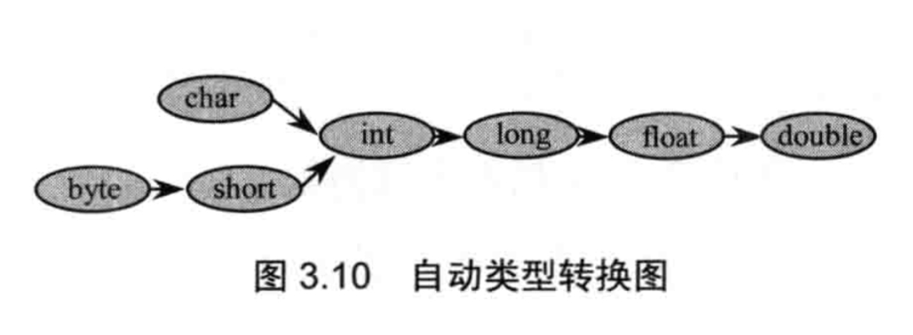
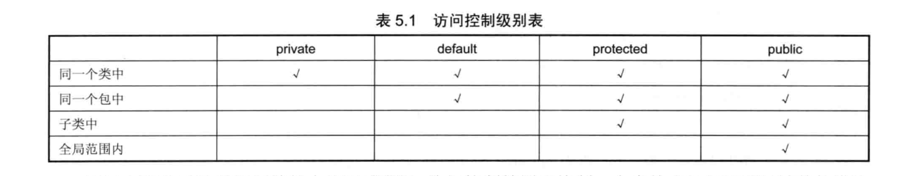

《疯狂java讲义》读书笔记

1. java7中，数值可以用下划线区分位数如：`int a = 12_3_4;`
2. boolean型数据占位一个byte，即8位，虽然一位即可表示，但是计算机最小分配单位为一个byte。
3. 7种基本数值类型可以自动类型转换，如下：


4. 如果上图向左转换，则需要强制转换，可能会造成数据丢失。
5. switch语句后面的控制表达式的数据类型只能是byte、short、char、int四种整数类型，枚举类型和java.lang.String类型（从java7开始）。
6. 如果一个成员变量不添加访问控制符，默认为default权限，不是protected。

7. 初始化块：类似于构造函数的功能，是一个代码块，执行顺序在构造函数之前，编译过后，代码会还原到构造函数中,格式如下两种，修饰符只能是static，内部可以是任何可执行代码  
8. 
```
{
int a = 1;
System.out.println("初始化块");
}
```
```
static {
int a = 1;
System.out.println("初始化块");
}
```
如果有父类，执行顺行是：父类初始化块>父类构造函数>子类初始化块>子类构造函数；多个初始化块按位置前后顺序执行。静态初始化块在类初始化阶段执行，优先于普通初始化块

9. ==和equals方法：  
	当用==判断两个变量是否相等时，如果两个变量是基本类型，且都是数值类型（不一定要求数据类型严格相同），则只要两个变量的值相等，就返回true，所以`int a = 65`、`float b = 65.0f`、`char c = 'A'`三个用==对比都反悔true。  
	但对于连个引用变量，只有他们指向同一个对象时，==才会返回true，==不用于比较类型上没有父子关系的两个对象，否则会编译出错。  
	equals（）方法是Object类提供的实例方法，作用和==一样，如果有别的特殊要求，可以自己重写equals（）方法，String中的equals（）方法就是重写过的，只要两个变量的值相同就返回true。
10. final修饰的成员变量必须显示的赋值，且只能赋值一次，final局部变量可以初始化时赋值，也可以在第一次用的时候赋值，一旦赋值后不能改变，final形参不能在方法内赋值，应在方法调用的时候传参。
11. final修饰的基本类型变量不能重新赋值，final修饰的引用类型变量所引用的对象不能变，但是对象的内容是可以改变的。
12. 抽象类不能被实例化，抽象类的构造函数用于被子类调用
13. 含有抽象方法的类（包括直接定义了一个抽象方法，或继承了一个抽象父类，但是没有完全实现父类包含的抽象方法，或实现了一个接口，但没有完全实现接口包含的抽象方法）只能被定义为抽象类，抽象类可以没有抽象方法。
14. abstract不能和final出现，abstract不能和static同时修饰一个方法
15. 接口可以继承多个，普通类只能继承一个
16. 内部类比外部类可以多使用三个修饰符：private、protectd、static——外部类不可以使用这三个修饰符
17. 非静态内部类不能拥有静态成员
18. 枚举类可以实现一个或多个接口，使用enum定义的枚举类默认继承java.lang.Enum类，而不是Object类，因此枚举类不能显式继承其他父类，其中java.lang.Enum实现了Serializable和Comparable接口。
19. 使用enum定义、非抽象的枚举类默认会使用final修饰，因此不能派生子类
20. 枚举类的构造器只能用privare访问控制符
21. 枚举类的所有实例必须在第一行显式列出，否则不能产生实例，列出实例时，系统自动添加 public static final 修饰
22. 垃圾回收机制只负责回收堆内存中的对象，不会回收任何物理资源
23. 在垃圾回收机制回收任何对象前，会先调用它的finalize()方法，该方法可能使该对象从新复活（让一个引用变量重新应用该对象），从而导致垃圾回收机制取消回收
24. System.gc()和Runtime.getRuntime().gc()可以通知系统执行垃圾回收，但是系统不一定会执行，只是会尽可能快的执行回收机制，两个函数功能一样
25. 软引用：内存不足时系统可能会回收
26. 弱引用：比软引用级别低，执行回收机制时会回收
27. 虚引用：类似于没有引用，主要用于跟踪对象被垃圾回收的状态，不能单独使用，必须和引用队列（ReferenceQueue）联合使用
28. System.identityHashCode(Object x)，返回制定对象精确的hashCode值，也就是根据该对象的地址计算出来的hashCode，如果两个对象的identityHashCode相同，则两个对象绝对是同一个对象
29. StringBuffer时线程安全的，StringBuilder不是，所以StringBuilder性能略高，一般情况下优先考虑StringBuilder
30. ThreadLocalRandom是java7新增的一个类，是Random的增强版，在并发访问的时候，可以减少多线程资源竞争，最终保证系统具有更好的线程安全性
31. Random r = new Random（x）如果种子x相同，则产生的伪随机数顺序相同，所以一般种子采用当前时间Random r = new Random(System.currentTimeMillis())
32. Calender 的add和roll区别：add（MONTH， 6）月份加6，自动进位，roll不进位；如果进位后，下一级也需要改变，则该字段会修正为变化的最小值，如：计算后的值为2004.2.31，则修正为2004.2.29
33. Set不能添加重复的对象，HashSet集合判断两个元素相等的标准是两个对象通过equals（）方法比较相等，并且两个元素的hachCode（）方法返回值也想等，否则就不认识两个元素想等。
34. 范型中类型参数可以设定多个上限（至多一个父类上限，可以有多个接口上限），类上限必须位于第一位 `public class Apple<T extends Number & java.io.Seralizable>`
35. 一个catch块捕获一个异常时，可以对异常变量重新赋值，如果同时捕获多个异常，用`|`隔开，异常变量有隐式的final修饰，不能重新赋值
36. 除非在try块、catch块中调用退出虚拟机的方法（System.exit(1)），否则不管在try块、catch块中执行怎样的代码，出现怎样的情况，异常处理的finally块总会被执行。
37. 通常情况下，不要在finally块中使用如return、throw等导致方法终止的语句，否则将导致try、catch块中的return、throw语句失效
